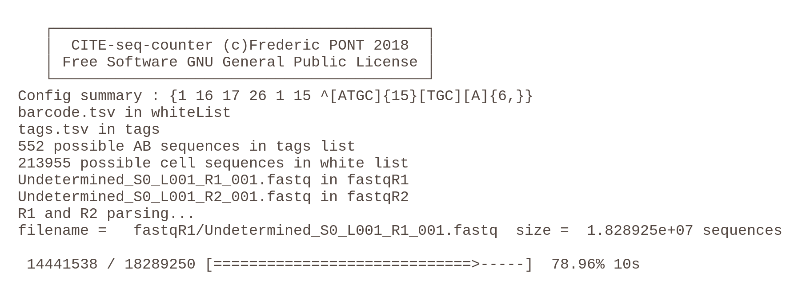

<h1>

CiteSeq Counter
 
 

</h1>

*CiteSeq Counter* is a software to count  the UMI of antibodies tags in raw sequencing reads. CITE-seq-counter has been tested with Single Cell CITE-seq samples processed with 10x Genomics technologies. Cell and antibody barcode positions are adjustable, UMI positions as well. A white list is mandatory in current version and 1 mismatch is allowed in the barcode and the UMI. PCR duplicates (same UMI + barcode) are excluded from the count.
The sofware is written in Go, it is fast and the memory usage is as low as possible. Only the result table and two sequences are stored in RAM at the same time.

 

